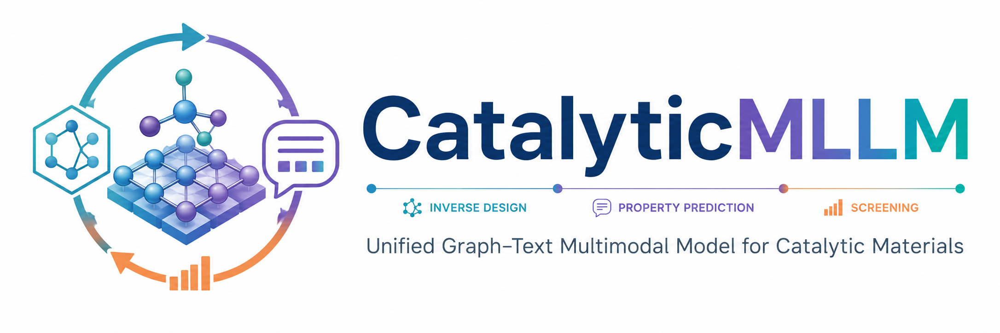

# CatalyticMLLM



CatalyticMLLM is a multimodal large model for catalytic-material and crystal-structure tasks. The model can learn both the forward mapping from structure to properties and the inverse mapping from target properties to structure. By combining an equivariant 3D geometry encoder with a large language model, CatalyticMLLM enables catalytic-material property prediction, CIF-level structure generation, and closed-loop optimization in a shared latent representation space. This approach overcomes issues in traditional separate generation-evaluation workflows, such as inconsistent representation spaces and decoupled models.

The core workflow of this repository is divided into three training stages:

1. Stage 1: SFT supervised fine-tuning
2. Stage 2: GRPO online reinforcement-learning training
3. Stage 3: IRFT iterative reward fine-tuning
4. Finally, use `CLI_inference.py` to launch interactive inference

## Table of Contents

- [Project Features](#project-features)
- [Environment Dependencies](#environment-dependencies)
- [Complete Workflow](#complete-workflow)
  - [Stage 1: SFT Supervised Fine-Tuning](#stage-1-sft-supervised-fine-tuning)
  - [Generate GRPO Training Data](#generate-grpo-training-data)
  - [Stage 2: GRPO Online Training](#stage-2-grpo-online-training)
  - [Stage 3: GA-GRPO Iterative Reward Fine-Tuning](#stage-3-ga-grpo-iterative-reward-fine-tuning)
  - [Interactive Inference](#interactive-inference)
- [FAQ](#faq)

## Project Features

- A unified multimodal large model integrating property prediction and inverse design for catalytic materials.
- Supports text prompts and molecular/crystal 3D structure inputs.
- Supports CIF structure generation tasks.
- Supports inverse-design tasks based on target energy.
- Provides `CLI_inference.py` as the entry point for interactive inference.

## Environment Dependencies

A Linux + CUDA + multi-GPU environment is recommended. The training scripts use `torchrun` and DeepSpeed by default.

```bash
conda create -n catalyticmllm python=3.10 -y
conda activate catalyticmllm
pip install ...
```

```text
torch==2.6.0
torchvision==0.21.0
transformers==4.50.0.dev0
deepspeed==0.16.4
flash_attn==2.7.4.post1
triton==3.0.0
accelerate==1.4.0
torchcodec==0.2
```

## Complete Workflow

### Stage 1: SFT Supervised Fine-Tuning

The first stage performs supervised fine-tuning of the base model on catalytic-material task data. You can launch either of the following scripts.

#### Option A: Text-side SFT

```bash
bash Q_fintune_turns.sh
```

Main configuration items in this script:

```bash
MODEL_PATH="/path/to/base_model"
OUTPUT_DIR="/path/to/output_dir"
DATASETS="MOLECULE_RELAXED_ENERGY_TUSNS_24K%100"
```

Note: before use, confirm that the dataset name in `DATASETS` has been registered in `qwen-vl-finetune/qwenvl/data/data_list.py`, or change it to a dataset alias that is valid in the current environment.

#### Option B: LoRA SFT

```bash
bash Q_fintune_lora.sh
```

Main configuration items in this script:

```bash
MODEL_PATH="/path/to/finetuned_model"
OUTPUT_DIR="/path/to/output_dir"
DATASETS="MOLECULE_RELAXED_ENERGY_CELL_24k%100"
```

The LoRA version enables:

```bash
--use_lora True
--lora_r 64
--lora_alpha 16
--lora_dropout 0.05
```

After Stage 1 is complete, use the output checkpoint as the input model for Stage 2 or Stage 3.

### Generate GRPO Training Data

Before Stage 2 training, run the data conversion script to generate `grpo_training_data.json`.

```bash
python convert_to_grpo_format.py
```

The default configuration of `convert_to_grpo_format.py` is inside the script:

```python
INPUT_FILE = "/path/to/training_data.json"
OUTPUT_FILE = "grpo_training_data.json"
MAX_SAMPLES = None
```

This script performs the following logic:

- Reads the original multi-task training JSON.
- Excludes `_property` tasks.
- Extracts the complete atomic composition from the ground-truth CIF.
- If extraction from the CIF fails, attempts to parse the chemical formula from the prompt.
- Saves the result as `grpo_training_data.json`.

To change the data source, modify `INPUT_FILE` in `convert_to_grpo_format.py`.

### Stage 2: GRPO Online Training

The GRPO stage uses `grpo_training_data.json` as the prompt data source. During training, the model samples multiple candidate CIFs online for each prompt, then computes within-group relative advantages according to the CIF reward function and updates the policy.

#### Option A: Non-LoRA GRPO

```bash
bash grpo_online_train.sh
```

Key configuration:

```bash
INPUT_MODEL="/path/to/finetuned_model"
TRAINING_DATA="grpo_training_data.json"
OUTPUT_DIR="/path/to/checkpoints/Qwen-grpo-online"
DEEPSPEED_CONFIG="qwen-vl-finetune/scripts/deepspeed_config_grpo.json"
```

#### Option B: LoRA GRPO

```bash
bash grpo_online_train_lora.sh
```

Key configuration:

```bash
INPUT_MODEL="/path/to/finetuned_model"
TRAINING_DATA="grpo_training_data.json"
OUTPUT_DIR="/path/to/checkpoints/Qwen-grpo-online-lora"
DEEPSPEED_CONFIG="qwen-vl-finetune/scripts/deepspeed_config_grpo_lora.json"
```

LoRA GRPO has lower GPU memory pressure and is usually more suitable for multi-round experiments.

The core Stage 2 training entry points are:

```text
qwen-vl-finetune/qwenvl/train/train_grpo_online.py
qwen-vl-finetune/qwenvl/train/train_grpo_online_lora.py
```

Training logic summary:

```text
prompt
  -> the current model generates K CIF candidates online
  -> CIFRewardModel scores the candidates
  -> compute the within-group mean, standard deviation, and advantage
  -> update the model using policy gradient / GRPO loss
```

### Stage 3: GA-GRPO Iterative Reward Fine-Tuning

The third stage continues training from the Stage 2 model and introduces ExemplarPool and an energy reward.

```bash
bash irft_stage3_train.sh
```

Key configuration:

```bash
INPUT_MODEL="/path/to/checkpoint"
TRAINING_DATA="grpo_training_data.json"
OUTPUT_DIR="/path/to/checkpoints/Qwen-irft-stage3-lora"
EXEMPLAR_POOL_PATH="${OUTPUT_DIR}/exemplar_pool.json"
```

Core GA-GRPO training entry point:

```text
qwen-vl-finetune/qwenvl/train/train_irft_stage3.py
```

Composite reward form:

```text
R_step3 = w_struct * R_step2 + w_energy * R_energy
R_energy = exp(-lambda * |E_pred - E_target|)
```

Default weights:

```bash
STRUCTURE_REWARD_WEIGHT=0.7
ENERGY_REWARD_WEIGHT=0.3
ENERGY_LAMBDA=1.0
EXEMPLAR_POOL_SIZE=50
```

### Interactive Inference

After training is complete, use `CLI_inference.py` to launch multi-turn interactive inference.

```bash
python CLI_inference.py
```

Before running, modify the model path and data path in the script:

```python
FINETUNED_MODEL_PATH = "/path/to/final/model_or_checkpoint"
JSON_DATA_PATH = "/path/to/inference/data.json"
```

`CLI_inference.py` will:

- Load `Qwen2_5_VLForMolecule`.
- Load `AutoProcessor`.
- Read the JSON data and build an `id -> item` index.
- Automatically detect text-only or multimodal mode based on the sample.
- Support 3D molecular structure input.
- Support streaming generation.

After startup, first enter a test sample id. The interactive commands are:

```text
exit / quit      exit
:id <sample_id>  switch sample
:info            view current sample information
:reset           clear conversation context
:multimodal      force switching to multimodal mode
:textonly        force switching to text-only mode
:auto            automatically detect mode based on training data
```

Example:

```text
Enter test sample id: random759040_cif
User> Please generate the corresponding CIF for this material.
Assistant> data_...
```

## FAQ

### 1. Is `grpo_training_data.json` an offline answer set?

No. It is only the prompt data source for GRPO/IRFT and contains prompts, expected atomic compositions, and optional molecule data. The actual candidate CIFs are generated online by the model during training.

### 2. What is the input to `convert_to_grpo_format.py`?

In the current project, `convert_to_grpo_format.py` reads the original multi-task conversations JSON, with the default path:

```text
/path/to/training_data.json
```

If your data file is not in this location, modify `INPUT_FILE` in the script.

### 3. What if the dataset name in `Q_fintune_turns.sh` cannot be found?

Check:

```text
qwen-vl-finetune/qwenvl/data/data_list.py
```

Confirm that the name in `DATASETS` has been registered. Currently visible dataset names include:

```text
MOLECULE_RELAXED_ENERGY
MOLECULE_RELAXED_ENERGY_CELL
MOLECULE_RELAXED_ENERGY_CELL_24k
```

If the name in the script is not registered, add the dataset configuration or change it to an existing name.

### 4. Is IRFT online sampling iteration?

Yes. `train_irft_stage3.py`, called by `irft_stage3_train.sh`, generates candidates online in each training step, scores them online, updates ExemplarPool, and computes a GRPO-style policy-gradient loss based on the composite reward.

### 5. How do I merge weights after LoRA training?

Refer to:

```bash
python Q_merge_lora_weights.py \
  --base_model /path/to/base_model \
  --lora_adapter /path/to/lora_adapter \
  --output_path /path/to/merged_model
```

Modify the specific paths according to the output directory of Stage 1 or Stage 2.

## Recommended Run Order

```bash
cd /path/to/CatalyticMLLM-V1
export PYTHONPATH="$PWD/qwen-vl-finetune:$PYTHONPATH"

# 1. Stage 1 SFT, choose one
bash Q_fintune_turns.sh
# or
bash Q_fintune_lora.sh

# 2. Generate GRPO prompt data
python convert_to_grpo_format.py

# 3. Stage 2 GRPO, choose one
bash grpo_online_train.sh
# or
bash grpo_online_train_lora.sh

# 4. Stage 3 GA-GRPO
bash irft_stage3_train.sh

# 5. Interactive inference
python CLI_inference.py
```

## Notes

- The training scripts and data paths in this repository are highly tied to the current server directories; check each script path before the first run.
- For quick validation only, consider setting `MAX_SAMPLES` in the data conversion script to a small value first.
- If GPU memory is insufficient, prioritize the LoRA-version scripts.
- To reproduce experimental results, keep the checkpoint, log files, and `exemplar_pool.json` for each stage.
