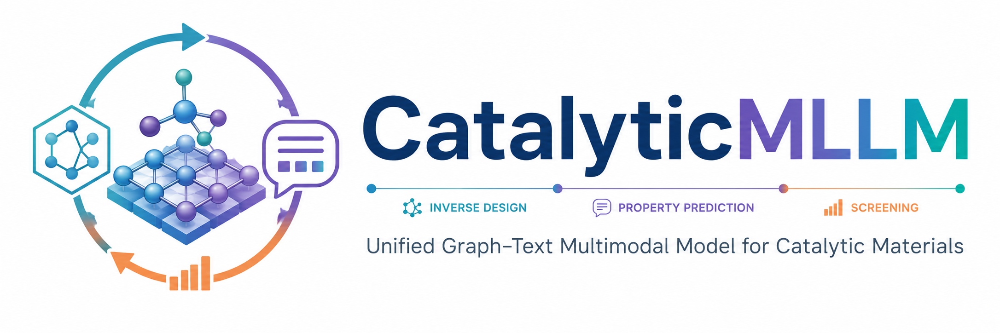
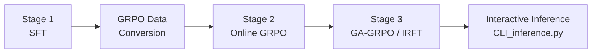

<div align="center">

# CatalyticMLLM

### A Unified Graph–Text Multimodal Large Language Model for Catalytic-Material Property Prediction and Inverse Design

<p>
  
  
  
  
  
</p>

**Property prediction · CIF generation · Energy-guided inverse design · Closed-loop optimization**



</div>

---

## Overview

**CatalyticMLLM** is a multimodal large model designed for catalytic-material and crystal-structure tasks. It learns both:

- **Forward mapping:** structure → properties
- **Inverse mapping:** target properties → structure

By combining an **equivariant 3D geometry encoder** with a **large language model**, CatalyticMLLM supports catalytic-material property prediction, CIF-level structure generation, and closed-loop optimization in a shared latent representation space. This unified design helps address limitations of conventional generation–evaluation pipelines, including inconsistent representation spaces and decoupled models.

### At a Glance

| Capability | Description |
| --- | --- |
| Multimodal input | Text prompts and molecular/crystal 3D structures |
| Property prediction | Predict catalytic-material properties from structures |
| Inverse design | Generate candidate structures from target properties or energy |
| Structure generation | Produce CIF-format crystal structures |
| Training pipeline | SFT → GRPO → GA-GRPO / IRFT |
| Interactive inference | Multi-turn CLI with text-only and multimodal modes |

---

## Training & Inference Pipeline


```mermaid
flowchart LR
    A[Stage 1<br/>SFT] --> B[GRPO Data<br/>Conversion]
    B --> C[Stage 2<br/>Online GRPO]
    C --> D[Stage 3<br/>GA-GRPO / IRFT]
    D --> E[Interactive Inference<br/>CLI_inference.py]
```

1. **Stage 1 — SFT:** supervised fine-tuning on catalytic-material task data.
2. **Data preparation:** convert source conversations into `grpo_training_data.json`.
3. **Stage 2 — GRPO:** online sampling and reward-based policy optimization.
4. **Stage 3 — GA-GRPO / IRFT:** iterative reward fine-tuning with `ExemplarPool` and an energy reward.
5. **Inference:** launch multi-turn interactive inference through `CLI_inference.py`.

---

## Table of Contents

- [Overview](#overview)
- [Training & Inference Pipeline](#training--inference-pipeline)
- [Project Features](#project-features)
- [Environment Setup](#environment-setup)
- [Quick Start](#quick-start)
- [Complete Workflow](#complete-workflow)
  - [Stage 1: SFT Supervised Fine-Tuning](#stage-1-sft-supervised-fine-tuning)
  - [Generate GRPO Training Data](#generate-grpo-training-data)
  - [Stage 2: GRPO Online Training](#stage-2-grpo-online-training)
  - [Stage 3: GA-GRPO Iterative Reward Fine-Tuning](#stage-3-ga-grpo-iterative-reward-fine-tuning)
  - [Interactive Inference](#interactive-inference)
- [Models & Weights](#models--weights)
- [FAQ](#faq)
- [Notes](#notes)

---

## Project Features

- **Unified architecture:** integrates property prediction and inverse design in one multimodal model.
- **Graph–text multimodality:** accepts text prompts and molecular/crystal 3D structure inputs.
- **CIF generation:** supports crystal-structure generation at the CIF level.
- **Energy-guided inverse design:** generates structures conditioned on target energy.
- **Online reward optimization:** supports GRPO and iterative reward fine-tuning.
- **Interactive CLI:** provides `CLI_inference.py` for multi-turn inference.

---

## Environment Setup

A **Linux + CUDA + multi-GPU** environment is recommended. Training scripts use `torchrun` and DeepSpeed by default.

### Create the Conda Environment

```bash
conda create -n catalyticmllm python=3.10 -y
conda activate catalyticmllm
```

### Install Dependencies

Install the project dependencies according to your environment and CUDA version.

> [!IMPORTANT]
> The original installation command contains a placeholder (`pip install ...`). Replace it with the repository's actual installation command or requirements file before running the project.

Reference package versions:

```text
torch==2.6.0
torchvision==0.21.0
transformers==4.50.0.dev0
deepspeed==0.16.4
flash_attn==2.7.4.post1
triton==3.0.0
accelerate==1.4.0
torchcodec==0.2
```

---

## Quick Start

```bash
cd /path/to/CatalyticMLLM-V1
export PYTHONPATH="$PWD/qwen-vl-finetune:$PYTHONPATH"

# 1. Stage 1 — choose one SFT strategy
bash Q_fintune_turns.sh
# or
bash Q_fintune_lora.sh

# 2. Generate GRPO prompt data
python convert_to_grpo_format.py

# 3. Stage 2 — choose one GRPO strategy
bash grpo_online_train.sh
# or
bash grpo_online_train_lora.sh

# 4. Stage 3 — GA-GRPO / IRFT
bash irft_stage3_train.sh

# 5. Launch interactive inference
python CLI_inference.py
```

> [!TIP]
> Before launching training, review every model, dataset, output, and DeepSpeed configuration path in the corresponding script.

---

## Complete Workflow

### Stage 1: SFT Supervised Fine-Tuning

The first stage performs supervised fine-tuning of the base model on catalytic-material task data. Choose either full/text-side SFT or LoRA SFT.

#### Option A: Text-Side SFT

```bash
bash Q_fintune_turns.sh
```

Main configuration:

```bash
MODEL_PATH="/path/to/base_model"
OUTPUT_DIR="/path/to/output_dir"
DATASETS="MOLECULE_RELAXED_ENERGY_TUSNS_24K%100"
```

> [!NOTE]
> Confirm that the dataset name in `DATASETS` is registered in `qwen-vl-finetune/qwenvl/data/data_list.py`. Otherwise, replace it with a valid dataset alias for your environment.

#### Option B: LoRA SFT

```bash
bash Q_fintune_lora.sh
```

Main configuration:

```bash
MODEL_PATH="/path/to/finetuned_model"
OUTPUT_DIR="/path/to/output_dir"
DATASETS="MOLECULE_RELAXED_ENERGY_CELL_24k%100"
```

LoRA configuration:

```bash
--use_lora True
--lora_r 64
--lora_alpha 16
--lora_dropout 0.05
```

After Stage 1, use the output checkpoint as the input model for Stage 2 or Stage 3.

---

### Generate GRPO Training Data

Before Stage 2, convert the original multi-task training data into `grpo_training_data.json`:

```bash
python convert_to_grpo_format.py
```

Default configuration inside `convert_to_grpo_format.py`:

```python
INPUT_FILE = "/path/to/training_data.json"
OUTPUT_FILE = "grpo_training_data.json"
MAX_SAMPLES = None
```

The conversion script:

1. Reads the original multi-task training JSON.
2. Excludes `_property` tasks.
3. Extracts the complete atomic composition from the ground-truth CIF.
4. Falls back to parsing the chemical formula from the prompt when CIF extraction fails.
5. Saves the converted data as `grpo_training_data.json`.

To use a different data source, update `INPUT_FILE` in `convert_to_grpo_format.py`.

---

### Stage 2: GRPO Online Training

Stage 2 uses `grpo_training_data.json` as the prompt source. For each prompt, the current policy generates multiple candidate CIFs online. The reward model scores those candidates, computes within-group relative advantages, and updates the policy.

#### Option A: Full-Parameter GRPO

```bash
bash grpo_online_train.sh
```

Key configuration:

```bash
INPUT_MODEL="/path/to/finetuned_model"
TRAINING_DATA="grpo_training_data.json"
OUTPUT_DIR="/path/to/checkpoints/Qwen-grpo-online"
DEEPSPEED_CONFIG="qwen-vl-finetune/scripts/deepspeed_config_grpo.json"
```

#### Option B: LoRA GRPO

```bash
bash grpo_online_train_lora.sh
```

Key configuration:

```bash
INPUT_MODEL="/path/to/finetuned_model"
TRAINING_DATA="grpo_training_data.json"
OUTPUT_DIR="/path/to/checkpoints/Qwen-grpo-online-lora"
DEEPSPEED_CONFIG="qwen-vl-finetune/scripts/deepspeed_config_grpo_lora.json"
```

LoRA GRPO reduces GPU-memory pressure and is generally more suitable for repeated experiments.

Core training entry points:

```text
qwen-vl-finetune/qwenvl/train/train_grpo_online.py
qwen-vl-finetune/qwenvl/train/train_grpo_online_lora.py
```

Training logic:

```text
Prompt
  └─> Current model generates K candidate CIFs online
        └─> CIFRewardModel scores each candidate
              └─> Compute group mean, standard deviation, and advantage
                    └─> Update the model with policy-gradient / GRPO loss
```

---

### Stage 3: GA-GRPO Iterative Reward Fine-Tuning

Stage 3 continues from the Stage 2 model and introduces `ExemplarPool` together with an energy-based reward.

```bash
bash irft_stage3_train.sh
```

Key configuration:

```bash
INPUT_MODEL="/path/to/checkpoint"
TRAINING_DATA="grpo_training_data.json"
OUTPUT_DIR="/path/to/checkpoints/Qwen-irft-stage3-lora"
EXEMPLAR_POOL_PATH="${OUTPUT_DIR}/exemplar_pool.json"
```

Core training entry point:

```text
qwen-vl-finetune/qwenvl/train/train_irft_stage3.py
```

Composite reward:

```text
R_step3 = w_struct * R_step2 + w_energy * R_energy
R_energy = exp(-lambda * |E_pred - E_target|)
```

Default reward and pool configuration:

| Parameter | Default |
| --- | ---: |
| `STRUCTURE_REWARD_WEIGHT` | `0.7` |
| `ENERGY_REWARD_WEIGHT` | `0.3` |
| `ENERGY_LAMBDA` | `1.0` |
| `EXEMPLAR_POOL_SIZE` | `50` |

---

### Interactive Inference

After training, launch multi-turn interactive inference:

```bash
python CLI_inference.py
```

Update the model and data paths in the script before running:

```python
FINETUNED_MODEL_PATH = "/path/to/final/model_or_checkpoint"
JSON_DATA_PATH = "/path/to/inference/data.json"
```

`CLI_inference.py` performs the following operations:

- Loads `Qwen2_5_VLForMolecule`.
- Loads `AutoProcessor`.
- Reads the JSON data and builds an `id -> item` index.
- Automatically selects text-only or multimodal mode based on the sample.
- Supports 3D molecular-structure inputs.
- Supports streaming generation.

#### Interactive Commands

| Command | Description |
| --- | --- |
| `exit` / `quit` | Exit the program |
| `:id <sample_id>` | Switch the active sample |
| `:info` | Display current sample information |
| `:reset` | Clear the conversation context |
| `:multimodal` | Force multimodal mode |
| `:textonly` | Force text-only mode |
| `:auto` | Detect the mode from the training data |

Example session:

```text
Enter test sample id: random759040_cif
User> Please generate the corresponding CIF for this material.
Assistant> data_...
```

---

## Models & Weights

| Directory | Model / Dataset | Hugging Face |
| --- | --- | --- |
| `Qwen/` | Qwen2.5-VL-3B | [Qwen/Qwen2.5-3B-Instruct](https://huggingface.co/Qwen/Qwen2.5-3B-Instruct) |
| `Qwen/` | Qwen2.5-VL-7B | [Qwen/Qwen2.5-7B-Instruct](https://huggingface.co/Qwen/Qwen2.5-7B-Instruct) |
| `pretrained_equiformer_v2/` | Equiformer-V2 | [Yanjie-CN/Equiformer-v2](https://huggingface.co/Yanjie-CN/Equiformer-v2) |
| `checkpoints/` | CatalyticMLLM-3B | [Yanjie-CN/CatalyticMLLM-3B](https://huggingface.co/Yanjie-CN/CatalyticMLLM-3B/tree/main) |
| `dataset/` | CatalyticMLLM-OC20 | [Yanjie-CN/CatalyticMLLM-OC20](https://huggingface.co/datasets/Yanjie-CN/CatalyticMLLM-OC20) |

---

## FAQ

<details>
<summary><strong>1. Is <code>grpo_training_data.json</code> an offline answer set?</strong></summary>

No. It is only the prompt data source for GRPO/IRFT. It contains prompts, expected atomic compositions, and optional molecule data. Candidate CIFs are generated online by the model during training.

</details>

<details>
<summary><strong>2. What is the input to <code>convert_to_grpo_format.py</code>?</strong></summary>

The script reads the original multi-task conversations JSON. Its default input path is:

```text
/path/to/training_data.json
```

Update `INPUT_FILE` in the script when your data is stored elsewhere.

</details>

<details>
<summary><strong>3. What if the dataset name in <code>Q_fintune_turns.sh</code> cannot be found?</strong></summary>

Check:

```text
qwen-vl-finetune/qwenvl/data/data_list.py
```

Confirm that the value of `DATASETS` is registered. Currently visible dataset names include:

```text
MOLECULE_RELAXED_ENERGY
MOLECULE_RELAXED_ENERGY_CELL
MOLECULE_RELAXED_ENERGY_CELL_24k
```

If the script references an unregistered name, add the corresponding dataset configuration or switch to an existing alias.

</details>

<details>
<summary><strong>4. Does IRFT perform online sampling and iteration?</strong></summary>

Yes. `train_irft_stage3.py`, called by `irft_stage3_train.sh`, generates candidates online at each training step, scores them online, updates `ExemplarPool`, and computes a GRPO-style policy-gradient loss from the composite reward.

</details>

<details>
<summary><strong>5. How do I merge weights after LoRA training?</strong></summary>

Use:

```bash
python Q_merge_lora_weights.py \
  --base_model /path/to/base_model \
  --lora_adapter /path/to/lora_adapter \
  --output_path /path/to/merged_model
```

Adjust the paths according to the Stage 1 or Stage 2 output directory.

</details>

---

## Notes

- Training scripts and data paths are closely tied to the current server directory layout; verify all paths before the first run.
- For a quick smoke test, set `MAX_SAMPLES` in the conversion script to a small value.
- When GPU memory is limited, prefer the LoRA variants.
- To reproduce experiments, retain checkpoints, logs, and the stage-specific `exemplar_pool.json` file.

---

<div align="center">

**CatalyticMLLM — bridging 3D catalytic structures and language-model reasoning.**

</div>
